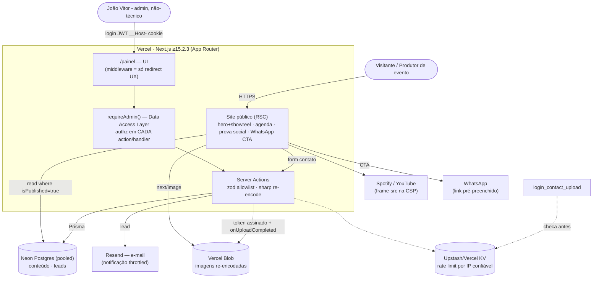

# João Vitor — Cantor Oficial · Blueprint de Arquitetura (v2)

> Status: **PROPOSTA REVISADA** — 3 lentes adversariais aplicadas (arquitetura, segurança, produto/operabilidade).
> Autor: Claude (skill `arquiteto`) · Revisão: **feita** (ritual 3x) · Correções incorporadas.
> Última atualização: 2026-07-21

**Changelog v1 → v2 (o que a revisão pegou e foi corrigido):**
- Schema não compilava (`MediaAsset` sem relações inversas) → **corrigido + relações nomeadas**.
- ADR-002 furado (`revalidateTag` não tagueia Prisma; sem pooling Neon) → **reescrito** (revalidatePath + Neon pooled).
- Auth: middleware não protege actions + CVE-2025-29927 → **authz por-action (DAL `requireAdmin`)**.
- Upload direto-pro-Blob não valida magic bytes + SVG XSS → **ADR-004 reescrito** (re-encode server + SVG banido).
- Lockout de conta = auto-DoS (admin único) → **removido**; throttle por IP + Turnstile + reset por e-mail.
- Faltava Vídeo e prova social → **entidades `Video`, `ClientLogo`, `Stat` adicionadas**.
- `ShowStatus` manual divergindo de `startsAt` → **derivado da data**; só `isCancelled` gravado.

---

## 0. Contexto & objetivo de negócio

Site institucional + painel administrativo para **João Vitor**, cantor sertanejo.
Não é "site bonito" — é **ferramenta de venda**: converter visitante (produtor de
evento, RH) em **booking de R$10–15k** para eventos corporativos. Substitui um Wix
inacabado (template placeholder).

Sucesso = (a) visitante entende em 5s que ele é artista grande e confiável;
(b) caminho até "falar com o João" é curto e óbvio; (c) o João mantém tudo sozinho,
sem dev, por anos, **sem conseguir quebrar o site**.

---

## 1. Reframe — a decisão real

O pedido "um painel pra gerenciar tudo" é a solução imaginada. A decisão de
arquitetura de verdade:

> **Como um artista não-técnico mantém um site público, seguro e sempre no ar,
> por anos, sem um desenvolvedor de plantão — sem virar buraco de segurança e sem
> conseguir quebrar a página que vende?**

Um "painel foda" que o João usa pra publicar um show pela metade ao vivo, ou que
abre porta de ataque, **falhou** — por mais bonito que seja.

---

## 2. As forças que decidem

1. **Mantenedor único e não-técnico.** Quem opera é o João. O admin esconde o
   modelo de dados; fala a língua dele; não deixa ele quebrar o site.
2. **Superfície pública exposta.** Login, upload e form de contato são as 3 portas
   que um atacante testa primeiro. Auth é por-ação, não por-pasta.
3. **Ops e custo ~zero.** Serverless + free tiers. Mas serverless + Postgres exige
   **pooling** — senão um pico derruba o banco.
4. **Tempo & impacto.** Entrega por escopo, cada um aprovável sozinho. Deploy e
   caminho de conversão **cedo**, não no fim.

---

## 3. Decisões já travadas

| Camada | Escolha | Nota crítica |
|---|---|---|
| Framework | Next.js App Router + TS, **≥ 15.2.3** | versão fixada por causa do CVE-2025-29927 (bypass de middleware) |
| UI | Tailwind v4 + shadcn/ui | design system on-brand |
| Banco | **Neon** (Postgres) + Prisma | usar **endpoint pooled** (`-pooler`) + `connection_limit`; considerar `@prisma/adapter-neon` |
| Auth | Auth.js **Credentials (estratégia JWT)** | Credentials força JWT; revogação via `tokenVersion` (não tabela Session) |
| Uploads | Vercel Blob | server **re-encoda com sharp** (strip EXIF/polyglot); SVG **banido** |
| Rate limit | **Upstash Redis / Vercel KV** | limitador compartilhado por IP confiável da Vercel (não XFF cru) |
| Notificação | **E-mail (Resend/SES)** | WhatsApp Business API fica pra depois; e-mail com throttle/digest |
| Deploy | Vercel (**conta correta a definir** — a logada é de terceiro) + `.com.br` via registro.br | preview por branch; deploy contínuo desde o Escopo 0 |
| Instagram auto-sync | fora do v1 | galeria via painel é a fonte |

---

## 4. ADRs

### ADR-001 — Admin: construir vs comprar  ✅ **decidido: custom enxuto**

Custom (server actions + Prisma + shadcn) vs Payload CMS vs SaaS headless.
**Recomendação e decisão: custom enxuto** — controle total, segurança do jeito do
cliente, on-brand.
**Correção da revisão:** "9 entidades = pouco código" era otimista. O custo real do
Escopo 2 **não** são os CRUDs triviais — é: upload inline + otimização, **drag-drop
de ordem**, editor markdown sanitizado, **inbox de leads**, e **estados de
rascunho/preview + fallbacks seguros**. Escopo 2 re-estimado com esses itens (§8).
**Gatilho de revisão:** multi-usuário com papéis, muitos tipos de conteúdo novos, ou
prazo apertar → **Payload** no mesmo Neon/app é a saída barata.

### ADR-002 — Renderização & atualização do site público  🔁 **reescrito**

- **Decisão:** RSC lendo Neon (endpoint **pooled**) + **`revalidatePath('/agenda')`**
  na server action que altera aquela seção. Site cacheado/estático-rápido; ao salvar,
  a página muda revalida.
- **Por que mudou:** `revalidateTag` **não** invalida query Prisma crua (só atinge o
  Data Cache de `fetch`/`use cache`). Taxonomia de tags seria máquina de estado
  desnecessária pra um site que muda poucas vezes/mês. `revalidatePath` por rota é
  mais simples, correto e fácil de raciocinar. (Se precisar granularidade fina depois,
  aí sim `unstable_cache`/`use cache` + `cacheTag`.)
- **Pooling (obrigatório):** `DATABASE_URL` no host `-pooler` do Neon
  (`?pgbouncer=true&connection_limit=1`) ou driver serverless + adapter. Sem isso,
  pico esgota conexões → 5xx no site inteiro.

### ADR-003 — Autenticação & autorização do admin  🔁 **reescrito**

- **Auth:** Credentials (e-mail + senha), **argon2id** (OWASP: m≥19MiB, t≥2, p=1).
  Credentials força **JWT** no Auth.js → revogação via **`tokenVersion`** no
  `AdminUser` (logout global = bump da versão). Sem tabela `Session`.
- **Authz (CRÍTICO — correção da revisão):** middleware é **só UX** (redirect otimista).
  A fronteira real é uma **Data Access Layer**: `requireAdmin()` chamado **dentro de
  cada Server Action / Route Handler / leitura sensível**. Motivo: CVE-2025-29927 (bypass
  de middleware via header) + Server Action é endpoint POST invocável direto. Layout
  **não** é authz.
- **Anti-brute-force (sem auto-DoS):** **removido lockout de conta** (admin único →
  qualquer um trancava o João pra fora). No lugar: rate limit por **IP confiável da
  Vercel** + backoff exponencial + **Turnstile** após N falhas + notificar por e-mail.
- **Enumeração/timing:** e-mail desconhecido roda **argon2 dummy** (tempo constante);
  **mensagem única** ("credenciais inválidas") em todos os casos.
- **Recuperação:** reset de senha por e-mail (token single-use, curto) — senão o
  "esqueci a senha às 3h" vira chamada pro dev.
- **Sessão/cookie:** confirmar CSPRNG do token (padrão Auth.js), rotação no login,
  prefixo `__Host-`, `HttpOnly`+`Secure`+`SameSite=Strict` (admin não tem navegação
  cross-site legítima), revogar tudo na troca de senha. 2FA (TOTP) = incremento fase 2.
- **Sem cadastro público.** Admin criado por **script de seed**.

### ADR-004 — Upload & mídia  🔁 **reescrito**

- **Fluxo:** admin (sessão válida) pede token de upload assinado → server assina com
  **`allowedContentTypes` (só raster: jpeg/png/webp/avif)**, **`maximumSizeInBytes`**,
  `addRandomSuffix`, expiração curta → cliente sobe pro Blob → **`onUploadCompleted`**
  re-encoda com **`sharp`** (strip EXIF/metadata/polyglot, converte pra webp,
  redimensiona) e grava `MediaAsset`.
- **Por que mudou:** upload direto-pro-Blob **não** deixa validar magic bytes no
  server (bytes não passam pelo app) → TOCTOU. `sharp` re-encodando é o que
  neutraliza polyglot/EXIF/payload.
- **SVG banido** (é XML: magic bytes não distinguem `<script>` embutido). Logos são
  assets nossos, não upload do admin. `next/image` com `dangerouslyAllowSVG=off`.
- **Otimização phone-first:** cliente comprime/redimensiona antes de subir (canvas)
  → fica sob o limite de body da Vercel (4,5MB) e o João nunca publica um PNG de 4MB.
- **Emissão do token:** rate-limitada por sessão (evita encher o Blob).

### ADR-005 — Contato = lead qualificado  🔁 **ampliado**

- **Captura:** form → server action com **zod (allowlist de campos)** → grava
  `ContactMessage` **e** notifica por **e-mail** (assíncrono, com throttle/digest —
  não 1 e-mail por submit).
- **Qualificação (correção de produto):** campos estruturados — tipo de evento,
  **data pretendida, cidade, faixa de orçamento, empresa** — pro João saber qual lead
  de R$10-15k vale retorno. Ciclo de vida: `status {NEW/CONTACTED/WON/LOST}` + `notes`.
- **Anti-abuso:** honeypot **+ time-to-submit** + rate limit global + Turnstile se
  surgir abuso. Nunca interpolar input em **headers** de e-mail (CRLF injection) —
  API com campos estruturados (Resend), input só no corpo.
- **LGPD (.com.br):** checkbox de consentimento + base legal; política de retenção
  (expurgar leads > X meses); minimizar PII na notificação ("novo lead, abra o
  painel"); **nunca logar** o corpo do form; se exportar CSV, **prefixar** campos que
  começam com `= + - @` (formula injection).
- **CTA primário:** WhatsApp pré-preenchido e **qualificante** ("Olá João, quero
  orçamento p/ evento corporativo — empresa ___, data ___"), sticky no mobile.

### ADR-006 — Rate limiting & IP confiável  ➕ **novo**

- Limitador **compartilhado** (Upstash Redis / Vercel KV) no edge, chaveado pelo
  **IP confiável da plataforma** (`x-vercel-forwarded-for` / `request.ip`) — **nunca**
  `x-forwarded-for` cru (spoofável). Aplicado a **todas** as rotas mutantes (login,
  contato, assinar-URL). Protege banco (conexões Neon), custo e abuso.

### ADR-007 — Ciclo de vida da mídia  ➕ **novo**

- **Sem media-picker global** (conceito de dev que trava o João). Foto se sobe
  **no lugar onde é usada** ("capa deste show: arraste aqui").
- **Delete protegido:** bloquear delete de `MediaAsset` referenciado (contar
  referências) **ou** soft-delete; ao deletar de fato, **apagar o blob** no Vercel
  (senão órfãos acumulam custo). `onDelete` explícito nas relações.

---

## 5. Modelo de dados (Prisma — v2, compila)

Princípio: **uma fonte de verdade por entidade**; imagens em `MediaAsset`,
referenciadas por id. Relações **nomeadas** (5 modelos apontam pro mesmo alvo).
Conteúdo nasce **rascunho** (`isPublished @default(false)`) — João publica de propósito.

```prisma
// --- Auth (Credentials → JWT; sem tabela Session) ---
model AdminUser {
  id                  String    @id @default(cuid())
  email               String    @unique
  passwordHash        String
  name                String
  tokenVersion        Int       @default(0)   // bump = revoga todas as sessões
  totpSecret          String?                 // 2FA fase 2
  passwordResetToken  String?   @unique
  passwordResetExpires DateTime?
  lastLoginAt         DateTime?
  createdAt           DateTime  @default(now())
}

// --- Mídia (fonte única de imagem) ---
model MediaAsset {
  id        String   @id @default(cuid())
  blobKey   String   @unique
  url       String
  mimeType  String
  sizeBytes Int
  width     Int?
  height    Int?
  alt       String   @default("")
  createdAt DateTime @default(now())
  // back-relations nomeadas (Prisma exige os dois lados)
  showCovers        Show[]          @relation("ShowCover")
  galleryItems      GalleryItem[]   @relation("GalleryMedia")
  testimonialAvatars Testimonial[]  @relation("TestimonialAvatar")
  pressAssets       PressKitAsset[] @relation("PressMedia")
  heroFor           SiteSettings[]  @relation("SettingsHero")
  clientLogos       ClientLogo[]    @relation("ClientLogoMedia")
}

// --- Conteúdo público ---
model Show {
  id          String      @id @default(cuid())
  title       String
  venue       String
  city        String
  state       String      // UF
  startsAt    DateTime
  ticketUrl   String?     // validar esquema https no zod
  description String?
  isCancelled Boolean     @default(false)   // upcoming/past é DERIVADO de startsAt
  coverId     String?
  cover       MediaAsset? @relation("ShowCover", fields: [coverId], references: [id])
  isPublished Boolean     @default(false)
  createdAt   DateTime    @default(now())
  updatedAt   DateTime    @updatedAt
  @@index([startsAt, isCancelled])
  @@index([isPublished])
}

model GalleryItem {
  id          String     @id @default(cuid())
  mediaId     String
  media       MediaAsset @relation("GalleryMedia", fields: [mediaId], references: [id])
  caption     String?
  category    GalleryTag @default(SHOW)
  sortOrder   Int        @default(0)   // reordenar = drag-drop (nunca expor o int)
  isPublished Boolean    @default(false)
  @@index([sortOrder])
}
enum GalleryTag { SHOW CORPORATE STUDIO OTHER }

model Video {                          // showreel / YouTube — ativo nº1 de conversão
  id          String  @id @default(cuid())
  youtubeId   String
  title       String
  isFeatured  Boolean @default(false)  // 1 vira o showreel do hero
  sortOrder   Int     @default(0)
  isPublished Boolean @default(false)
}

model Service {
  id String @id @default(cuid())
  title String
  description String
  icon String?              // nome de ícone lucide
  sortOrder Int @default(0)
  isPublished Boolean @default(false)
}
model Differential {
  id String @id @default(cuid())
  title String
  description String
  icon String?
  sortOrder Int @default(0)
  isPublished Boolean @default(false)   // padronizado
}
model Testimonial {                     // render: Home + seção prova social
  id String @id @default(cuid())
  author String
  role String?              // empresa / cargo
  quote String
  avatarId String?
  avatar MediaAsset? @relation("TestimonialAvatar", fields: [avatarId], references: [id])
  sortOrder Int @default(0)
  isPublished Boolean @default(false)
}
model ClientLogo {                      // "quem já contratou" — prova social B2B
  id String @id @default(cuid())
  name String
  mediaId String
  media MediaAsset @relation("ClientLogoMedia", fields: [mediaId], references: [id])
  websiteUrl String?
  sortOrder Int @default(0)
  isPublished Boolean @default(false)
}
model Stat {                            // faixa de métricas (+300 shows, +50 mil pessoas)
  id String @id @default(cuid())
  label String
  value String
  sortOrder Int @default(0)
  isPublished Boolean @default(false)
}
model PressKitAsset {
  id String @id @default(cuid())
  label String
  type PressType
  mediaId String?
  media MediaAsset? @relation("PressMedia", fields: [mediaId], references: [id])
  externalUrl String?       // rider/PDF — validar esquema https
  sortOrder Int @default(0)
}
enum PressType { PHOTO LOGO RIDER BIO_PDF OTHER }

// --- Config/conteúdo singleton (sempre 1 linha) ---
model SiteSettings {
  id             String  @id @default("singleton")
  bioHeadline    String
  bioBody        String  // markdown → renderizar SANITIZADO (rehype-sanitize)
  heroId         String?
  hero           MediaAsset? @relation("SettingsHero", fields: [heroId], references: [id])
  whatsapp       String  // obrigatório — CTA morre sem ele
  instagramUrl   String
  youtubeUrl     String
  facebookUrl    String
  spotifyArtistUrl String
  updatedAt      DateTime @updatedAt
}

// --- Leads (ativo comercial) ---
model ContactMessage {
  id        String     @id @default(cuid())
  name      String
  email     String
  phone     String?
  company   String?
  eventType String?
  eventDate DateTime?
  city      String?
  budgetRange String?
  message   String
  status    LeadStatus @default(NEW)
  notes     String?
  createdAt DateTime   @default(now())
  @@index([status])
  @@index([createdAt])
}
enum LeadStatus { NEW CONTACTED WON LOST }
```

---

## 6. Diagrama C4 — Contêiner



---

## 7. Segurança — hardening checklist (by-default)

**Auth/authz**
- [ ] `requireAdmin()` (DAL) em **cada** Server Action, Route Handler e leitura sensível. Middleware = só redirect. Layout ≠ authz. *(SEC-001)*
- [ ] Next **≥ 15.2.3** (CVE-2025-29927). *(SEC-001)*
- [ ] argon2id (m≥19MiB,t≥2,p=1); **sem lockout de conta**; throttle por IP confiável + Turnstile; argon2 dummy p/ e-mail inexistente; erro único. *(SEC-004, 009)*
- [ ] Cookie `__Host-`, `HttpOnly`+`Secure`+`SameSite=Strict`; rotação no login; revogar via `tokenVersion` na troca de senha. *(SEC-008)*
- [ ] Mutação = **Server Action** (herda check de Origin do Next). Route handler mutante → validar `Origin`/`Sec-Fetch-Site` manual. *(SEC-010)*

**Upload/render**
- [ ] Token de upload com `allowedContentTypes` raster + `maximumSizeInBytes` + `addRandomSuffix`; **SVG banido**; `sharp` re-encoda no `onUploadCompleted`; `next/image` sem `dangerouslyAllowSVG`. *(SEC-002)*
- [ ] Markdown (`bioBody`) renderizado **sanitizado** (rehype-sanitize/DOMPurify); **proibido `dangerouslySetInnerHTML`** em dado de usuário/lead. *(SEC-003)*
- [ ] CSP com **nonce por request** (`script-src 'self' 'nonce' 'strict-dynamic'`, **nunca** `unsafe-inline` em script); `object-src 'none'`, `base-uri 'self'`, `frame-ancestors 'none'`, `frame-src` só Spotify/YouTube. Subir em Report-Only primeiro. *(SEC-005)*
- [ ] URLs de campo (`ticketUrl`, `externalUrl`, `*Url`) validadas p/ esquema **https** no zod (bloquear `javascript:`/`data:`). *(SEC-016)*

**Rede/dados**
- [ ] Rate limit compartilhado (KV) por IP **confiável da Vercel**, em todas as rotas mutantes. *(SEC-006)*
- [ ] Notificação de lead: e-mail com campos estruturados (sem input em header), throttle/digest, cap de tamanho. *(SEC-007)*
- [ ] Leitura pública **sempre** `where isPublished` (não vazar rascunho); actions com zod **allowlist** (sem spread do body → mass assignment). *(SEC-014)*
- [ ] LGPD: consentimento + retenção/expurgo + minimização; nunca logar corpo; CSV export com prefixo anti-fórmula. *(SEC-012, 013)*

**Segredos/headers**
- [ ] `import 'server-only'` em módulos db/auth; env validado (zod/t3-env); `AUTH_SECRET` ≥32B; error boundary genérico em prod; **grep de segredo no bundle no CI**. *(SEC-018)*
- [ ] Headers: HSTS `includeSubDomains; preload`, `X-Content-Type-Options`, `Referrer-Policy`, `Permissions-Policy` (off camera/mic/geo), sem `X-Powered-By`. Validar em securityheaders.com. *(SEC-017)*

---

## 8. Roadmap por escopos (v2 — reordenado p/ impacto cedo)

### Escopo −0.5 — Material & contas  *(começa AGORA, tem lead time, bloqueia o "wow")*
Pedir ao João (lista §9). Definir a **conta Vercel correta** (a logada é de terceiro)
e registrar o `.com.br` — pré-requisito do deploy contínuo.

### Escopo 0 — Fundação & Design System
Repo + git, Next.js ≥15.2.3 + TS strict, Tailwind v4 + shadcn, ESLint/Prettier, env
schema, estrutura de pastas, `import 'server-only'`. **Design tokens** "Meia-Noite no
Palco", componentes base, **motif soundwave** animado. Otimização das fotos.
**Entregável: `/style-guide` já num URL real (deploy contínuo)** pra aprovar a cara cedo.

### Escopo 1 — Site público + caminho de conversão
As 8 seções + **showreel/vídeo** no hero + **prova social** (logos + métricas +
depoimentos) + Spotify. **CTA WhatsApp sticky** e **form mínimo por e-mail já aqui**
(não esperar o admin pra captar lead). Mobile-first, acessível, **SEO local + JSON-LD
`Performer`/`LocalBusiness`** + **OG 1200×630 dedicado**. Dados mockados.

### Escopo 2 — Backend & Painel Admin  *(re-estimado — o grosso do trabalho)*
Neon pooled + Prisma (migrations, seed de admin), Auth.js + DAL `requireAdmin`, rate
limit (KV), CRUD das entidades **com**: upload inline + `sharp`, **drag-drop de ordem**,
markdown sanitizado, **inbox de leads qualificados**, **rascunho/publicar + preview**,
**fallbacks seguros** (agenda vazia → "em breve, fale comigo"; hero/whatsapp/bio não
podem ficar vazios; delete de mídia em uso bloqueado), **faixa de saúde do site**.
`security-review` pesado aqui.

### Escopo 3 — Produção
Env vars, CSP/headers em prod, domínio `.com.br`, analytics (medir clique no WhatsApp),
backup do banco, reset de senha por e-mail funcionando.

### Escopo 4 — Futuro
Instagram (com ressalvas), 2FA, WhatsApp Business API, multilíngue, repertório (`Song`).

---

## 9. Material a pedir ao João  *(bloqueia o "wow", tem lead time — pedir já)*

O material atual limita o teto: só 1 foto horizontal (e é a mais "caipira"), retratos
são recorte de celular, **zero vídeo**, logo branca sobre branco, nenhuma em vetor.
Pedir, em ordem de impacto:

1. **Vídeo ao vivo horizontal 60–90s** (showreel), de preferência evento corporativo com plateia. *(maior gap — é o que mais fecha booking)*
2. **1–2 fotos profissionais horizontais, solo, luz escura/dramática** — hero desktop.
3. **Fotos com plateia / palco / evento corporativo real** — prova de "artista grande" + preenche a categoria CORPORATE (hoje vazia).
4. **Depoimentos** de contratantes (1 em vídeo, se der) + **nomes/logos** de empresas/eventos que já o contrataram.
5. **Números reais**: nº de shows, público, anos de estrada, cidades.
6. **Rider técnico (PDF)** + **release/bio one-page (PDF)** — Kit Imprensa.
7. **Logo em vetor (SVG)** + PNG transparente, nas duas cores (clara e escura) — pedir à Gigeck Produções.
8. **Fotos em alta resolução** (as atuais são de celular).

**Uso imediato enquanto não chega:** `Foto sem fundo João Vitor.png` (recorte alto) compõe
um **hero mobile** decente sobre fundo escuro + soundwave. `Foto JV 2 - 1.png` e
`Foto JV 2 - 1_1.png` são **duplicata byte-idêntica** (descartar uma). Não usar o trio de
fundo floral (`FOTO PAG 4`) como hero.

---

## 10. Princípios que ficam pra você (mentoria)

1. **O pedido é a solução imaginada; ache o problema.** "Quero um painel" = "como o artista se mantém sozinho, seguro, sem quebrar o site".
2. **Arquitetura é tradeoff sob restrição, não "melhor stack".** As 4 forças decidiram.
3. **Reversibilidade.** Gastei decisão no que é caro desfazer (modelo, auth, render). Cor/layout muda barato.
4. **Segurança é fundação.** Authz vive **na ação**, não na pasta. Middleware não é fronteira.
5. **Fonte única de verdade por entidade.** `MediaAsset` centraliza imagem; com política de ciclo de vida (senão vira órfão/FK quebrada).
6. **Revisão adversarial pega o que o autor não vê.** As 3 lentes acharam schema que não compilava, cache que não invalidava e um CVE de auth. Plano sem revisão é chute organizado.
```
